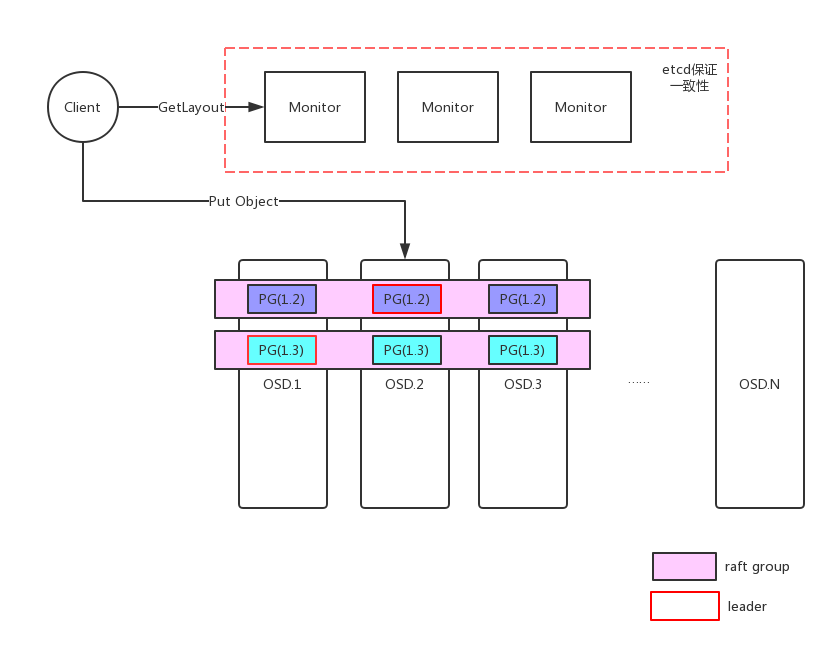

# Nentropy 设计

小文件的存储一直是分布式存储设计的难点, 这里的小文件
它有2个主要问题需要解决:

1. 如何高效率的在本地存储小文件?
2. 如何在分布式系统中平衡延迟和一致性?

## 本地存储小文件

优化存储小文件的思路大体就是和并小IO, 更新小文件也不再in-place更新, 而是永远一直写新的位置,
这2种方式都可以减少随机IO. 这个想法最早出现在文件系统的研究中, 参考论文[The Design and Implementation of a Log-Structured File System](https://people.eecs.berkeley.edu/~brewer/cs262/LFS.pdf)或者这个[这个Slide](http://www.eecs.harvard.edu/~cs161/notes/lfs.pdf)也有很多介绍.

和此对应的在userspace里面的实现就是facebook存储图片的论文:[Finding a needle in Haystack: Facebook’s photo storage](https://www.usenix.org/legacy/event/osdi10/tech/full_papers/Beaver.pdf) 或者
[bitcask的论文](http://basho.com/wp-content/uploads/2015/05/bitcask-intro.pdf)

Nentropy选择了根据论文[WiscKey: Separating Keys from Values
in SSD-conscious Storage](https://www.usenix.org/system/files/conference/fast16/fast16-papers-lu.pdf), 开发的[badge-io](https://github.com/dgraph-io/badger), 这个存储引擎把实际数据存储在VLOG中, 而对应的索引结构持久化在类似于levelDB的KV数据库中, 由于
KV数据库只存储实际小文件的索引, 这个KV数据库非常小, 也可以极大地减少写放大的压力, 从badge[官方对比测试数据](https://blog.dgraph.io/post/badger-lmdb-boltdb/)看, 在badge存储的value大于1KB时, badge的读写性能大约是[boltDB](https://github.com/boltdb/bolt)的4倍到100倍. badge-io的架构刚好适合存储小文件, 如1KB ~ 2MB左右的图片.  

小文件存储的底层引擎不同于
一般Key-Value存储引擎, 它的value比较大(1KB ~ 2MB). 而rocksdb等kv数据库的典型应用的value通常不到几百字节. 之前笔者压测过用Rocksdb存储图片, 由于写放大的问题, 效果不如预期. 而badge-io反而在大value下表现更好.

此外, badge-io也不同于[bitcask](http://basho.com/wp-content/uploads/2015/05/bitcask-intro.pdf), bitcask采用HashTable存储所有索引. 所有索引都放在内存, 对内存空间要求也高. badge-io相比bitcask也更节省内存.

基于以上2个原因, Nentropy选择badge-io作为底层存储引擎.

## Raft算法保证数据一致性

分布式性一致性通过[Raft协议](raft.github.io)解决, 由于raft leader在收到多数成功后就返回, 相比与其他强一致分布式系统, 写入延迟更小.
Raft算法的实现采用[etcd的raft实现](https://github.com/coreos/etcd/tree/master/raft), 在read策略上, 我们也不需要严格的Linearizability
Read. 选择Lease read, 即使有可能存在时钟漂移, 出现stale read, 在对象存储的应用中也完全可以接受.

# 架构

## Object映射

在写入object前，需要先创建pool， 写入object时需要指定pool名字，monitor会根据object的名字的hash值和特殊的掩码规则分配到该pool下的某一个pg上， 代码如下

	func Cale_bits_of(num int) int {
		return bits.Len(uint(num))
	}
	
	func Calc_pg_masks(pg_num int) int {
		pg_num_mask := 1<<uint(Cale_bits_of(pg_num-1)) - 1
		return pg_num_mask
	}
	
	func Nentropy_str_hash(s string) uint32 {
		h := fnv.New32a()
		h.Write([]byte(s))
		return h.Sum32()
	}
	
	func Nentropy_stable_mod(x, b, bmask int) int {
		if (b & bmask) < b {
			return x & bmask
		} else {
			return x & (bmask >> 1)
		}
	}

	hash := protos.Nentropy_str_hash(in.ObjectName)
	mask := protos.Calc_pg_masks(int(pgNumbers))
	hashPgId := protos.Nentropy_stable_mod(int(hash), int(pgNumbers), mask)
	pgName := fmt.Sprintf("%d.%d", poolId, hashPgId)
	

## Pg的分配

根据创建pool时的副本数目配置项size，该pool内的各个pg会通过一致性hash算法及故障域要求分配到某几个osd上，故障域目前支持HOST和ZONE.分配流程大致如下：

	1.将全部的osd节点参考权重后，生成虚节点落到hash环上
	2.将pgId哈希后也落到hash环上
	3.顺时针选取最近的虚节点，要求虚节点对应的osd不重复，且OSD所处的故障域id不重复，达到指定的副本数目后结束。

## Member List 管理

使用开源memberlist库实现全部节点的状态管理，monitor及osd节点都包含了memberlist实例，启动时通知其他节点自身的节点类型，节点编号和用于rpc通信的ip和端口号，当某一个osd故障后，monitor会收到消息通知，并修改该osd状态为down，故障超过5分钟后，自动设置osd状态为out，并重新计算全部pool的pg的分布，且下发更新后的pgmap到全部的osd节点，触发后续的动作。当某个osd故障恢复后重新上线，会设置osd状态为in，并重新计算pg分布。

## 加减OSD
加减osd都会引起hashRing上虚节点的数目增减，进而引起部分pg到osd的映射发生变动，从而更新pgmap，新的pgmap被同步到各个osd节点上后，会触发创建replica的操作，新建的replica的peers来自monitor该pg状态里的全部成员和本地记录的pg状态里的全部成员及最新的pgmap里的成员的并集。raft里的leader replica会向其他replicas发送confchange的propose的请求，等待全部的replica同步完成后，再通过confchange剔除已经不存在于最新的pg成员里的osd上的replica成员。

## 修改badger-io, 支持Nentropy的snapshot
当某个pg上的raft group内有新replica加入，或者是follower跟leader的index差异过大时会触发snapshot全量恢复，需要将主replica上的全部kv同步到落后的replica上，但是开源badger-io的生成快照方式为顺序读取存储的全部kv并序列化为一个文件，速度很慢，且额外占用磁盘空间。为了快速的将一个badger内的全部数据快速的复制到另一个osd节点上，对badger做了一些修改，snapshot恢复流程如下

	1.主pg禁止vlog的gc，正在进行的gc直接退出
	2.禁止由于sst合并引起的删除文件操作，要删除的文件记录到删除队列里
	3.将bagder目录下面的manifest、sst、vlog文件拷贝到对目的osd节点应的badger目录下
	4.拷贝完成后删除主pg的badger的删除队列的文件，允许删除文件
	5.允许vlog的gc
	4.新分配的pg实例reopen拷贝过来的badger文件
	5.通过raft的机制实现拷贝过程中的新增修改的增量同步

## Multiraft

## Truncate Log

# 与其他分布式系统对比

# 性能测试

## 4k随机写

节点数：3

cpu: Intel(R) Xeon(R) CPU E5-2620 v4 @ 2.10GHz

raid卡：PM8060-DefaultValue3

硬盘：普通SATA 6T*1

	Summary :
	Concurrency :16
	Size :4096
	Time taken for tests :180.001305199 seconds
	Complete requests :1000000
	Total transferred :4096000000 bytes
	Requests per second :5555 [#/sec]
	Transfer rate :22222 [Kbytes/sec]

## 4k随机读

	Start Bench Test!!!
	Method:read    Thread:16    Size:4096    RunName:1779185060412984
	Current Ops:8092/s  BandWidth:32368K/s TotalCount:8092
	Current Ops:8578/s  BandWidth:34312K/s TotalCount:16670
	Current Ops:8640/s  BandWidth:34560K/s TotalCount:25310
	Current Ops:8540/s  BandWidth:34160K/s TotalCount:33850
	Current Ops:8438/s  BandWidth:33752K/s TotalCount:42288
	Current Ops:8617/s  BandWidth:34468K/s TotalCount:50905
	Current Ops:8444/s  BandWidth:33776K/s TotalCount:59349
	Current Ops:8437/s  BandWidth:33748K/s TotalCount:67786
	Current Ops:8508/s  BandWidth:34032K/s TotalCount:76294
	Current Ops:8452/s  BandWidth:33808K/s TotalCount:84746
	Current Ops:8627/s  BandWidth:34508K/s TotalCount:93373
