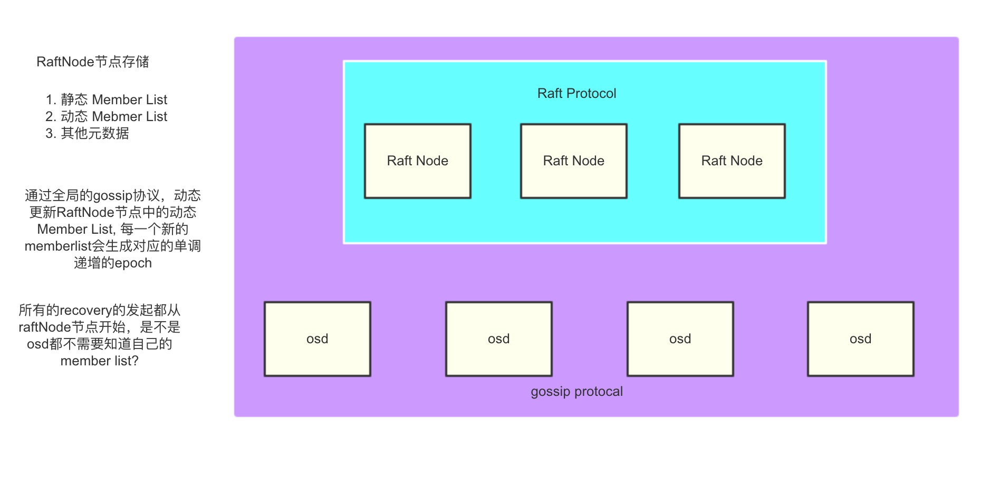

# 功能

主要提供CRUD, 只提供CRD的功能，不支持object的update操作，这样可以大大简化recovery的复杂度，不会出现我们需要写入
正在recovery的object

所以，先不考虑aio的情况, 接口非常简单

```
netropy_write
netropy_read
```


# 基本架构


# 基础通讯层

1. 底层通过grpc通信
2. gossip采用memberlist的实现，可能有的地方不能用grpc


# Raft Node层

存储这些数据:

1. 静态 Member List
2. 动态 Mebmer List
3. 其他元数据
4. pg的存储位置

# 核心存储层

选择有2个
1. badger-io存储, 需要做compact
2. 采用haystack的方式，所有元数据存储在内存中,定期flush, 也需要做compact

*无论哪种情况，都要考虑到object比较大，比如4M, 并且是从网络上stream下来的，可能还需要
做某种切分，参考kstore*

# Recovery

和ceph类似，有2种，一个是recovery，一个是backfill; 与ceph不同，我们再次简化实现，
osd的一个filestore对应多个pg, 
我们的实现应该是一个osd对应1个或者多个pg,1个pg对应一个badger-io, 这样也会让recovery提速。


# Netropy Road Map 

1. 先实现坐在grpc通信层上的raft和gossip协议

2. 在osd层使用badger-io

3. sharding层 *重要！！！*

和ceph的client可以直接访问osd, 然后osd可以用lazy的方式不同，我们上实现最为简单的方式：

pg的位置是存储在raftnode上面， 所以每次请求都会访问raftnode节点，然后再跳到osd节点，这也是大部分分布式系统的实现方式.
我们先实现这个情况，这样会大大简化所有的实现，再未来再考虑是否用ceph的方式，由client直接计算osd的位置. 这种简单实现，把所有的元数据都存储在raftnode上面，调度也由raftnode决定, osd也不再需要被通知memberlist的变化，我们就只需要stupid的osd,而不是ceph里面的 smart osd, 唯一的问题就是raftnode上面多了些读请求，并且延迟大了几毫秒，
这对于对象存储完全不是问题

4. Recovery的实现

5. 性能测试
